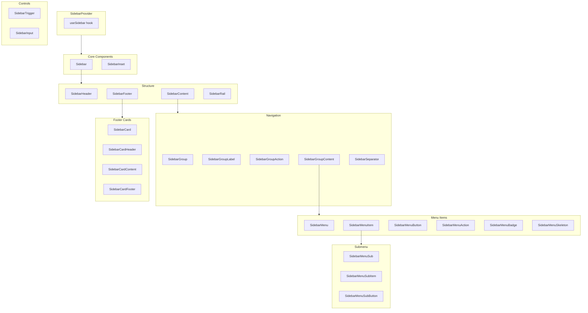

# Sidebar Component - Final Implementation Plan

## Source Analysis Summary

### From [shadcn/ui Sidebar](https://ui.shadcn.com/docs/components/radix/sidebar)

Full component API including:

- `SidebarProvider` - context with `defaultOpen`, `open`, `onOpenChange`
- `Sidebar` - main container with `side`, `variant`, `collapsible` props
- Structure: `SidebarHeader`, `SidebarContent`, `SidebarFooter`, `SidebarRail`
- Navigation: `SidebarGroup`, `SidebarGroupLabel`, `SidebarGroupAction`, `SidebarGroupContent`
- Menu: `SidebarMenu`, `SidebarMenuItem`, `SidebarMenuButton`, `SidebarMenuAction`, `SidebarMenuSub`, `SidebarMenuSubItem`, `SidebarMenuSubButton`, `SidebarMenuBadge`, `SidebarMenuSkeleton`
- Controls: `SidebarTrigger`, `SidebarInset`
- Hook: `useSidebar` returning `state`, `open`, `setOpen`, `openMobile`, `setOpenMobile`, `isMobile`, `toggleSidebar`

### From OpenAI Platform (`/Users/sergey/Downloads/sidebar`)

**Structure observed**:

```
<main data-sidebar="expanded" data-mobile-menu="hidden">
  <aside class="JiHZk">
    <div data-sidebar-collapsible="">
      <div class="sQbJC">           <!-- group container -->
        <h3 class="cTBD-">Create</h3>  <!-- group label -->
        <a class="k-D0f _8xE3c" aria-current="page">
          <span class="abr-y">
            <span class="J42DB"><svg>...</svg></span>  <!-- icon -->
            <span class="lp65A">Agent Builder</span>   <!-- label -->
          </span>
        </a>
      </div>
      <div class="z3hHU">           <!-- footer section -->
        <div class="eE5Hy">...</div> <!-- CTA card -->
        <div class="_-7Sdn">...</div> <!-- external links -->
        <button>collapse</button>
      </div>
    </div>
  </aside>
</main>
```

**Groups**: "Create", "Manage", "Optimize" (Dashboard) / "Settings", "Organization", "Project" (Settings)

### From [Untitled UI](https://www.untitledui.com/react/components/sidebar-navigations)

- **Dual-tier variant**: Icon rail + content panel side-by-side
- **Footer cards**: Progress, CTA, Onboarding with dismiss functionality
- **Separator**: Visual divider between groups

---

## Component Architecture



---

## Files to Create

| File                                                                                       | Description                            |
| ------------------------------------------------------------------------------------------ | -------------------------------------- |
| [src/components/Sidebar/useSidebarContext.ts](src/components/Sidebar/useSidebarContext.ts) | Context provider and `useSidebar` hook |
| [src/components/Sidebar/Sidebar.tsx](src/components/Sidebar/Sidebar.tsx)                   | All subcomponents (20+)                |
| [src/components/Sidebar/Sidebar.module.css](src/components/Sidebar/Sidebar.module.css)     | CSS module styles                      |
| [src/components/Sidebar/index.tsx](src/components/Sidebar/index.tsx)                       | Barrel exports                         |
| [src/components/Sidebar/Sidebar.stories.tsx](src/components/Sidebar/Sidebar.stories.tsx)   | Storybook stories                      |
| [src/components/Sidebar/Sidebar.mdx](src/components/Sidebar/Sidebar.mdx)                   | Documentation                          |

---

## Design Tokens

### CSS Variables (from OpenAI Platform)

```css
:root {
  /* Dimensions */
  --sidebar-width: 320px;
  --sidebar-width-mobile: 288px;
  --sidebar-width-icon: 48px;
  --sidebar-header-height: 48px;
  --sidebar-header-height-md: 56px; /* @media (min-width: 768px) */

  /* Colors */
  --sidebar-background: var(--color-surface);
  --sidebar-foreground: var(--color-text);
  --sidebar-border: var(--color-border);
  --sidebar-accent: var(--color-background-primary-soft);
  --sidebar-accent-foreground: var(--color-text-emphasis);

  /* Transitions */
  --sidebar-transition-duration: 0.35s;
  --sidebar-collapse-transition-duration: 0.3s;
  --sidebar-cubic-move: cubic-bezier(0.4, 0, 0.2, 1);
}
```

### Collapse Transition States

The sidebar uses state-based transitions for smooth animation:

```css
/* Transition states from OpenAI CSS */
[data-base-page-sidebar="expanding"],
[data-base-page-sidebar="expanded"] {
  --base-page-sidebar-width: var(--base-page-sidebar-expanded-width);
}

[data-base-page-sidebar="expanded"] {
  --base-page-panel-transition-duration: 0.35s;
}

/* Group labels fade during collapse */
[data-sidebar="collapsed"] .SidebarGroupLabel {
  opacity: 0;
  transition: opacity var(--sidebar-collapse-transition-duration) var(--sidebar-cubic-move);
}
```

### Typography

```css
/* Group Label (from cTBD-) */
.SidebarGroupLabel {
  padding: 0 12px 8px;
  color: var(--color-text-tertiary);
  font-size: 13px;
  font-weight: var(--font-weight-medium);
  line-height: 14px;
}

/* Menu Button (from k-D0f) */
.SidebarMenuButton {
  display: flex;
  align-items: center;
  gap: 8px;
  padding: 8px 12px;
  border-radius: var(--radius-sm);
  font-size: 14px;
  line-height: 1.4;
}
```

### Icon Specs

```css
.SidebarMenuButton .icon {
  width: 1em;
  height: 1em;
  flex-shrink: 0;
  fill: currentColor;
}
```

---

## Component API

### SidebarProvider

```typescript
type SidebarProviderProps = {
  defaultOpen?: boolean // @default true
  open?: boolean // controlled
  onOpenChange?: (open: boolean) => void
  style?: CSSProperties & {
    "--sidebar-width"?: string
    "--sidebar-width-mobile"?: string
  }
  children: ReactNode
}
```

### useSidebar Hook

```typescript
function useSidebar(): {
  state: "expanded" | "collapsed"
  open: boolean
  setOpen: (open: boolean) => void
  openMobile: boolean
  setOpenMobile: (open: boolean) => void
  isMobile: boolean
  toggleSidebar: () => void
}
```

### Sidebar

```typescript
type SidebarProps = {
  side?: "left" | "right" // @default "left"
  variant?: "sidebar" | "floating" | "inset" | "dual-tier" // @default "sidebar"
  collapsible?: "offcanvas" | "icon" | "none" // @default "offcanvas"
  dir?: "ltr" | "rtl" // RTL support
  children: ReactNode
}
```

### SidebarMenuButton

```typescript
type SidebarMenuButtonProps = {
  asChild?: boolean
  isActive?: boolean
  size?: "sm" | "md" | "lg" // @default "md"
  tooltip?: string | TooltipContentProps // shown when collapsed (icon mode)
  children: ReactNode
}
```

**Tooltip behavior in collapsed mode**:

- When `collapsible="icon"` and sidebar is collapsed, tooltip auto-shows on hover
- Uses existing Plex UI `Tooltip` component
- Shows on right side by default (or left if `side="right"`)

### SidebarInput (Search)

```typescript
type SidebarInputProps = ComponentPropsWithoutRef<"input"> & {
  shortcut?: string // e.g. "⌘K" - displayed as badge
}
```

### SidebarCard (Footer Card)

```typescript
type SidebarCardProps = {
  variant?: "default" | "outline" | "filled"
  dismissible?: boolean
  onDismiss?: () => void
  children: ReactNode
}
```

---

## Data Attributes

```html
<!-- Sidebar state (on wrapper) -->
<div data-sidebar="expanded">
  <!-- expanded | collapsed -->
  <div data-base-page-sidebar="expanded">
    <!-- expanding | expanded | collapsing | collapsed -->
    <div data-base-page-sidebar-hidden="false">
      <!-- true | false -->
      <div data-mobile-menu="visible">
        <!-- visible | hidden -->

        <!-- Sidebar props (on aside) -->
        <aside data-side="left">
          <!-- left | right -->
          <aside data-variant="sidebar">
            <!-- sidebar | floating | inset | dual-tier -->
            <aside data-collapsible="offcanvas">
              <!-- offcanvas | icon | none -->

              <!-- Menu state -->
              <button data-active="true">
                <!-- active menu item -->
                <button data-text-only="true">
                  <!-- text-only mode (no icon) -->
                  <div data-state="open">
                    <!-- collapsible group state -->

                    <!-- Card -->
                    <div data-dismissible="true">
                      <!-- Icon-only collapse styling (from OpenAI) -->
                      [data-sidebar=collapsed] .SidebarGroupLabel { opacity: 0; }
                      [data-sidebar=collapsed] .SidebarMenuButton .label { display: none; }
                    </div>
                  </div>
                </button>
              </button>
            </aside>
          </aside>
        </aside>
      </div>
    </div>
  </div>
</div>
```

---

## Key Features

1. **Collapsible modes**: `offcanvas` (mobile drawer), `icon` (shrink to icons), `none`
2. **Variants**: `sidebar`, `floating`, `inset`, `dual-tier`
3. **Mobile drawer**: Uses Radix Sheet for offcanvas on mobile
4. **Keyboard shortcut**: `Cmd+B` / `Ctrl+B` toggle
5. **RTL support**: `dir` prop, physical positioning with `data-side`
6. **Submenu**: `SidebarMenuSub` for nested navigation with chevron
7. **Loading state**: `SidebarMenuSkeleton` for async loading
8. **Footer cards**: Dismissible cards for CTAs, progress, onboarding
9. **Separator**: Visual divider between groups
10. **Search input**: `SidebarInput` with keyboard shortcut badge (⌘K)
11. **Text-only mode**: `data-text-only` for Settings-style navigation without icons
12. **Tooltip on collapsed**: Auto-show tooltip with label when in icon-only mode
13. **Collapse button**: `SidebarTrigger` in footer with animated icon rotation

## Sidebar Layout Variants (from screenshots)

### Dashboard Layout

- Groups with icons: "Create", "Manage", "Optimize"
- Each item: icon + text label
- Active state: background highlight

### Settings Layout

- Text-only items (no icons)
- Groups by scope: "Settings", "Organization", "Project"
- Active state: background highlight

### Docs/API Layout

- Search input at top with ⌘K shortcut
- Hierarchical navigation with chevron indicators
- Expandable sections with indented sub-items

---

## Icon-Only Collapse Mode

When `collapsible="icon"` and sidebar is collapsed:

```
+--------+
| [icon] |  ← Chat (tooltip on hover)
| [icon] |  ← Agent Builder
| [icon] |  ← Audio
|  ...   |
+--------+
   48px
```

**Behavior**:

- Width shrinks from 320px to 48px
- Group labels fade out (`opacity: 0`)
- Menu button labels hidden, only icons remain
- Icons centered horizontally
- Tooltip shows label on hover (using Plex `Tooltip`)
- Footer CTA card simplified or hidden
- Collapse button icon rotates 180deg

---

## Dual-Tier Layout

```
+--------------------------------------------------+
| Icon Rail (48px)  |  Content Panel (272px)       |
| +--+              |                              |
| |🏠| ← active     |  Expanded menu for           |
| +--+              |  selected section            |
| |📊|              |                              |
| +--+              |  Both columns scroll         |
| |⚙️|              |  independently               |
| +--+              |                              |
+--------------------------------------------------+
```

---

## Reference Patterns

**Plex UI patterns to follow**:

- [src/components/Menu/Menu.tsx](src/components/Menu/Menu.tsx) - Context, compound components
- [src/components/Popover/Popover.tsx](src/components/Popover/Popover.tsx) - Radix integration

**External references**:

- [shadcn/ui Sidebar](https://ui.shadcn.com/docs/components/radix/sidebar)
- [Untitled UI Sidebar](https://www.untitledui.com/react/components/sidebar-navigations)

---

## Storybook

Add "Sidebar" to `storySort.order` in [.storybook-base/preview.tsx](.storybook-base/preview.tsx) alphabetically after "SegmentedControl".
